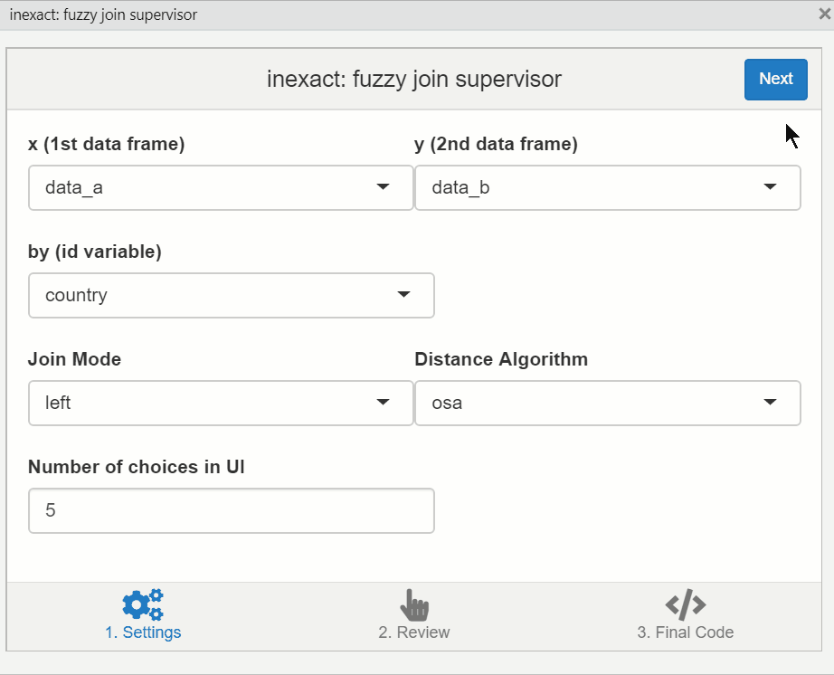

`inexact`: an RStudio addin to supervise fuzzy joins
================

## TL;DR

Merge data sets with inexact ID variables! Getting help from (and supervising) an approximate string matching algorithm.



## Introduction

Merging data sets is everyone’s favorite task. Especially when dealing
with data in which ID variables are not standardized. For instance,
politicians’ names can be spelled differently in multiple sources (press
reports, official documents, etc.), causing regular merging methods to
fail. Fun times\! `inexact` aims to help you when dealing with problems
like this one. It provides a simple graphical interface, which
automatically recommends the best matches between the two ID variables
(using the amazing
[`stringdist`](https://cran.r-project.org/web/packages/stringdist/index.html)
package), while also giving you the chance to override the algorithm
when needed. The result is code to safely and reproducibly perform your
inexact join\!

## Installation

The package is currently in early development. You can install it with
the following command:

``` r
remotes::install_github("arcruz0/inexact")
```

## Explanation and usage

Consider the following data sets:

``` r
(data_a <- data.frame(country  = c("Argentina", "Chile", "Bolivia", "Brasil"),
                      col_a = 1:4, stringsAsFactors = F))
```

    ##     country col_a
    ## 1 Argentina     1
    ## 2     Chile     2
    ## 3   Bolivia     3
    ## 4    Brasil     4

``` r
(data_b <- data.frame(country  = c("Argentina", "Chile", "Bolivia (Plurinational State of)", "Brazil"),
                      col_b = 11:14, stringsAsFactors = F))
```

    ##                            country col_b
    ## 1                        Argentina    11
    ## 2                            Chile    12
    ## 3 Bolivia (Plurinational State of)    13
    ## 4                           Brazil    14

Imagine that we want to left-join these data sets. In this case, we
might want to add the “col\_b” column to “data\_a”, in order to have
only one data set with all the information. However, the naming of the
countries is inconsistent, leading to an incomplete join:

``` r
dplyr::left_join(data_a, data_b, by = "country")
```

    ##     country col_a col_b
    ## 1 Argentina     1    11
    ## 2     Chile     2    12
    ## 3   Bolivia     3    NA
    ## 4    Brasil     4    NA

This result can be improved using approximate string matching, a way of
quantifying the distance between two given strings. The following
calculates the matrix of string distances between the ID columns, using
the optimal string alignment algorithm (“osa”) implemented in the
[`stringdist`](https://cran.r-project.org/web/packages/stringdist/index.html)
package.

``` r
matches_matrix <- stringdist::stringdistmatrix(data_a$country, 
                                               data_b$country,
                                               method = "osa")
rownames(matches_matrix) <- data_a$country
colnames(matches_matrix) <- data_b$country

matches_matrix
```

    ##           Argentina Chile Bolivia (Plurinational State of) Brazil
    ## Argentina         0     8                               27      7
    ## Chile             8     0                               29      5
    ## Bolivia           7     6                               25      5
    ## Brasil            7     5                               27      1

This matrix is used by the
[`fuzzyjoin`](https://cran.r-project.org/web/packages/fuzzyjoin/index.html)
package to merge the two data sets, employing the minimum value for each
row in the matrix. This will work perfectly for Chile and Argentina,
countries with unambiguous matches, and also for the “Brasil”-“Brazil”
pair, with a very obvious string difference of 1. However, this approach
is unsatisfactory when attempting to match the values for Bolivia. The
minimum string distance in the third row is 5, wrongly assigning it to
“Brazil” in the second data set. This is clearly a case that would
benefit from human supervision.

This is when `inexact` can be helpful. It is called from the RStudio
“Addins” panel, or by using the `inexact:::inexact_addin()` command.
As illustrated by the GIF above, it shows users the inexact
matches between the two data sets, allowing them to override the
suggestions by the algorithm when needed.

The result is a reproducible chunk of code to perform the inexact join,
which registers the employed algorithm and any corrections made by the
user:

``` r
inexact::inexact_join(
  x  = data_a,
  y  = data_b,
  by = 'country',
  method = 'osa',
  mode = 'left',
  custom_match = c(
   'Bolivia' = 'Bolivia (Plurinational State of)'
  )
)
```

    ##     country col_a col_b
    ## 1 Argentina     1    11
    ## 2     Chile     2    12
    ## 3   Bolivia     3    13
    ## 4    Brasil     4    14
